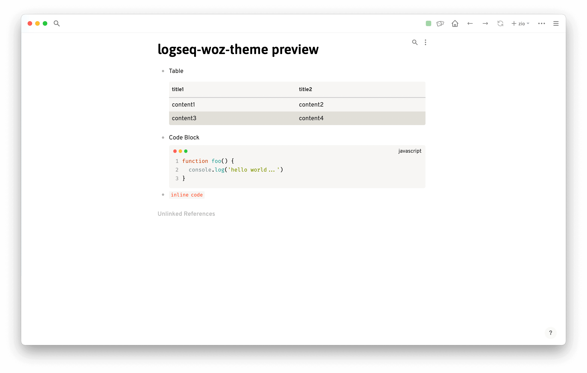
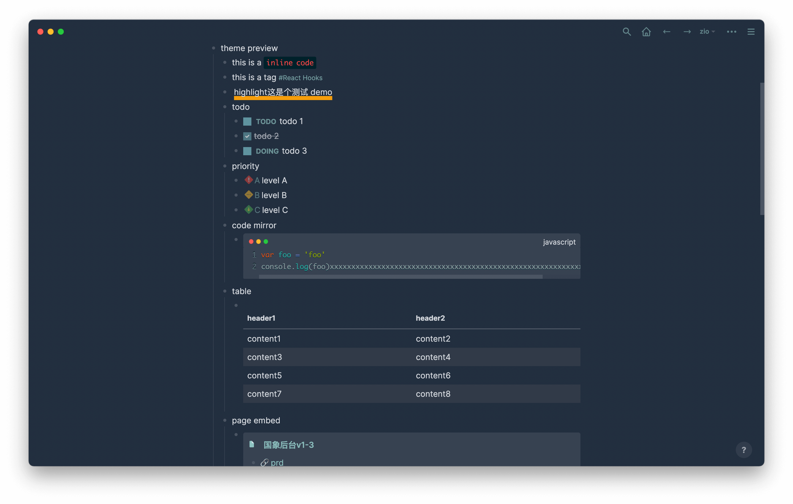

# Logseq Woz Theme

fork 自 [logseq-dev-theme](https://github.com/pengx17/logseq-dev-theme), 修改了代码块 表格等样式


## Working Demo

https://knowledge-garden.vercel.app/

## Usage

The easiest way to adopt this theme is to use jsDelivr CDN by adding the following line to your `custom.css`. You can also change the `@master` part to use the latest version.

```css
@import url("https://cdn.jsdelivr.net/gh/haydenull/logseq-woz-theme@main/custom.css");
```

Alternatively, you can download this repo and load it as a Logseq Theme Plugin.

## Demo



